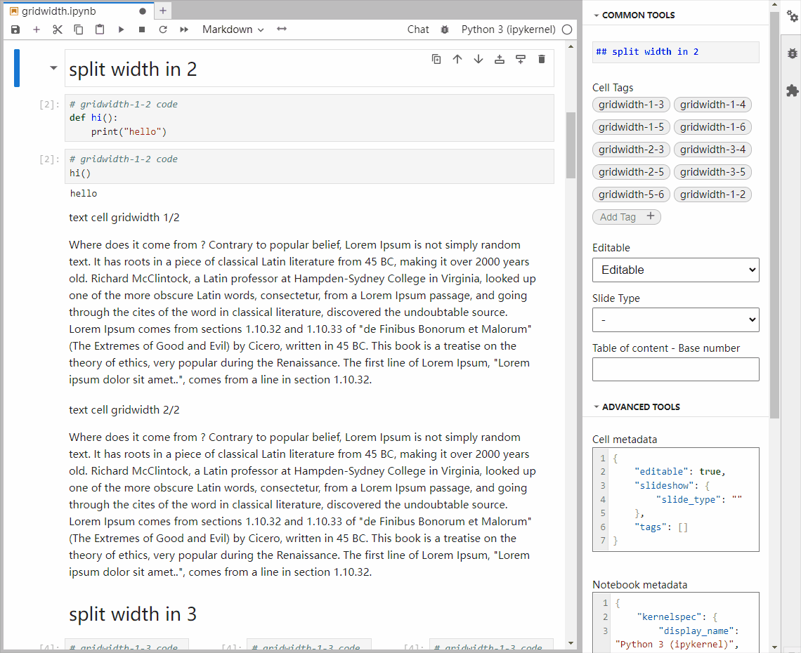

# jupyterlab-gridwidth

[](https://github.com/parmentelat/jupyterlab-gridwidth/actions/workflows/build.yml)

JupyterLab extension to

- tag cells so that they use a fraction of the width
- can replace former 'split-cell' extension in the classic notebook



It was preferred not to re-use the term 'split', because in jupyterlab _split_ already means, well, to split a cell into 2 cells...

## Requirements

- JupyterLab >= 4.0.0

## Usage

### as a replacement for for former `split-cell`

You can use

- either press the `<->` button on the notebook toolbar and use the drop down list to perform cell width adjustment (shown in the demo gif above)
- or keyboard `Alt+1, Alt+2` (meaning you want to use 1 / 2 of the horizontal space)
- or type `gridwidth` in the Palette and pick 1/2
- or command `gridwidth:toggle-1-2`
- that you can bind to a keyboard shortcut of your choice
- you can also apply width change to multiple cells which are selected (use `shift + click` or `shift + up/down` to select)

### to convert your notebooks

```bash
splitcell-to-gridwidth notebook1 .. notebookN
```

will replace the old `cell_style: split` with the new `gridwidth-1-2` tag in all
notebooks passed as arguments

### palette commands

- `gridwidth:toggle-1-2` and so on
- `gridwidth:cancel` to reset to full width

### keyboard shortcuts

- `Alt+1, Alt+2` and so on; these will toggle the corresponding tag, and
  remove any other tag that might be present
- `Alt+0` to reset to full width

### available tags:

- `gridwidth-1-2` (50%)
- `gridwidth-1-3` (~33%) `gridwidth-2-3` (~66%)
- `gridwidth-1-4` `gridwidth-2-4`, `gridwidth-3-4`
- `gridwidth-1-5` `gridwidth-2-5`, `gridwidth-3-5`, `gridwidth-4-5`
- `gridwidth-1-6` `gridwidth-2-6`, `gridwidth-3-6`, `gridwidth-4-6`, `gridwidth-5-6`

### other controls

since this exclusively relies on the presence of the above tags, you can also
use jupyterlab's so called "Property Inspector" feature; of course in this case
you're in charge of dealing with duplicate tags...


### limitations

rendering is exclusively done in CSS; converting to a non-HTML format will ruin
this layout

however we will try to provide a CSS file usable with jupyter-book to
preserve the layout in jb's HTML output (not yet available)

## Install

To install the extension, execute:

```bash
pip install jupyterlab-gridwidth
```

### Uninstall

To remove the extension, execute:

```bash
pip uninstall jupyterlab-gridwidth
```

### Development install

**_WARNING_** from this point on, this is the boilerplate text that comes with
the extension cookie-cutter template; it is not guaranteed to be accurate

Note: You will need NodeJS to build the extension package.

The `jlpm` command is JupyterLab's pinned version of
[yarn](https://yarnpkg.com/) that is installed with JupyterLab. You may use
`yarn` or `npm` in lieu of `jlpm` below.

```bash
# Clone the repo to your local environment
# Change directory to the jupyterlab-gridwidth directory
# Install package in development mode
pip install -e "."
# Link your development version of the extension with JupyterLab
jupyter labextension develop . --overwrite
# Rebuild extension Typescript source after making changes
jlpm build
```

You can watch the source directory and run JupyterLab at the same time in
different terminals to watch for changes in the extension's source and
automatically rebuild the extension.

```bash
# Watch the source directory in one terminal, automatically rebuilding when needed
jlpm watch
# Run JupyterLab in another terminal
jupyter lab
```

With the watch command running, every saved change will immediately be built
locally and available in your running JupyterLab. Refresh JupyterLab to load the
change in your browser (you may need to wait several seconds for the extension
to be rebuilt).

By default, the `jlpm build` command generates the source maps for this
extension to make it easier to debug using the browser dev tools. To also
generate source maps for the JupyterLab core extensions, you can run the
following command:

```bash
jupyter lab build --minimize=False
```

### Development uninstall

```bash
pip uninstall jupyterlab-gridwidth
```

In development mode, you will also need to remove the symlink created by
`jupyter labextension develop` command. To find its location, you can run
`jupyter labextension list` to figure out where the `labextensions` folder is
located. Then you can remove the symlink named `jupyterlab-gridwidth` within
that folder.

### Packaging the extension

See [RELEASE](RELEASE.md)
